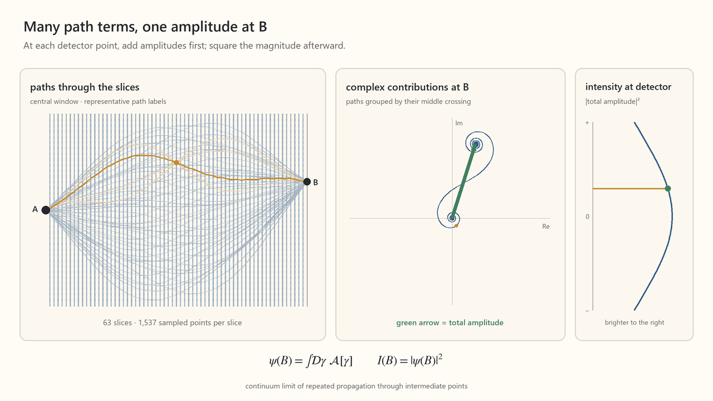

# Progressive desktop animation: slits to paths

[Play the 64-second animation](../../content/drafts/animations/symmetry-progressive-slits-to-path-integral.mp4)



The sequence continues the desktop visual language of the single-screen,
49-opening animation: warm ivory field, three horizontal panels, blue
alternatives, gold selection, and a green resultant. The existing animation
and its reel derivatives remain separate assets.

## Sequence

| Time | Visible change |
|---|---|
| 0–8 s | Build the contributions through the 49 openings in order. |
| 8–14 s | Scan the detector; the route geometry, phasor sum, and intensity marker move together. |
| 14–18 s | Remove the physical barrier while retaining an imaginary intermediate slice. |
| 18–20 s | Hold the one-slice calculation. |
| 20–30 s | Insert 3, then 7 imaginary slices; each complete crossing sequence labels a path term. |
| 30–45 s | Refine to 15, 31, and 63 slices and increase transverse sampling from 385 to 769 to 1,537 points. |
| 45–50 s | Replace the repeated-integral notation with the formal path-integral limit. |
| 50–60 s | Scan B again while retaining the dense path construction. |
| 60–64 s | Hold the final result for reading. |

The middle panel groups terms by their crossing point on the middle slice.
With one slice, this is one contribution per sampled opening or point.
With several slices, one arrow sums all earlier and later choices through
that middle point. The gold family illustrates several members of one such
group. The full blue path family is representative, not an enumeration.

The left panel shows only the central transverse window. Counts refer to the
full padded numerical domain. For M points on each of N intermediate slices,
the expansion contains M^N crossing sequences. Intermediate fields already
include propagation from the source distribution.

## Mathematical scope

This follows the distinction in
[What an “Alternate Path” Means for a Wave](symmetry-explain-wave-paths.md):
removing a physical screen changes the field; inserting imaginary slices to
factor the same free propagation does not introduce additional obstacles.

The new generator uses one compositional paraxial wave model throughout.
It preserves the previous animation's visual idiom and 49-opening starting
construction, but does not reproduce its spherical-distance intensity curve.
The old spherical weights cannot simply be multiplied through arbitrary
additional planes while preserving the same wave equation.

The source A is a localized Gaussian with amplitude width 0.18, represented
by a source marker. The wavelength is 0.5, the source-to-detector distance is
9, and the initial aperture lies halfway between them. The initial 49 grid
samples span -2.8 to +2.8. All later meshes cover the same padded transverse
period, approximately 44.917.

Free propagation uses

```math
U(z)=F^{-1}\operatorname{diag}\!\left(e^{-izq^2/(2k)}\right)F.
```

The finite Fourier propagator satisfies U(a)U(b)=U(a+b). Repeated complete
intermediate sums therefore yield the same endpoint field, without
enumerating every crossing sequence. The arrow through middle-grid point j
is the product of the forward field there and the remaining transfer to B.
The detector uses the squared magnitude of exactly the same total.

The physical barrier is removed with a continuously varying transmission
mask; the changing complex field is calculated before taking its magnitude.
After removal, increasing the number of imaginary planes does not change
the intensity. A fixed common phase rotates every displayed phasor equally.
Neither phase nor intensity is individually rescaled between frames.

The final path-integral expression denotes the continuum limit of repeated
propagation in this forward paraxial construction. A finite render with 63
planes is not claimed to evaluate infinitely many planes. The numerical
model also has a finite periodic transverse window. Refinement, padding,
and an independent unbounded Gaussian solution check the displayed region.

## Regeneration and checks

Install the dependencies in `scripts/requirements-progressive-animation.txt`
into the Python environment used for animation. An optional repository-local
package directory `.tools/animation-python-packages` is detected automatically.

```powershell
python -m pip install -r scripts/requirements-progressive-animation.txt
python scripts/generate_symmetry_progressive_paths.py --check --preview --render --qa
```

The renderer produces an MP4, final PNG, contact sheet, and four inspection
stills in `content/drafts/animations`. The QA command fully decodes the MP4
and creates dense grids of actual encoded frames at two frames per second,
plus additional samples around transitions, under the ignored directory
`.tools/progressive-animation-qa`.

Numerical checks cover composition, norm preservation, grouped sums at
off-grid detector positions, an explicitly enumerated 25-path small-grid
case, mesh refinement, doubled padding, and the independent Gaussian
solution. The checked amplitude errors are below 1e-11 for algebraic
identities and below 1e-4 for spatial convergence.

Source files:

- `scripts/generate_symmetry_progressive_paths.py`
- `scripts/progressive_paths_model.py`
- `scripts/requirements-progressive-animation.txt`
